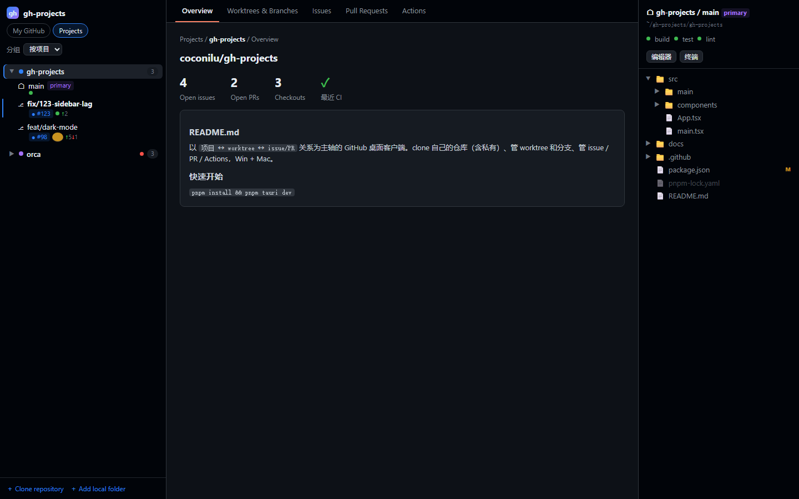
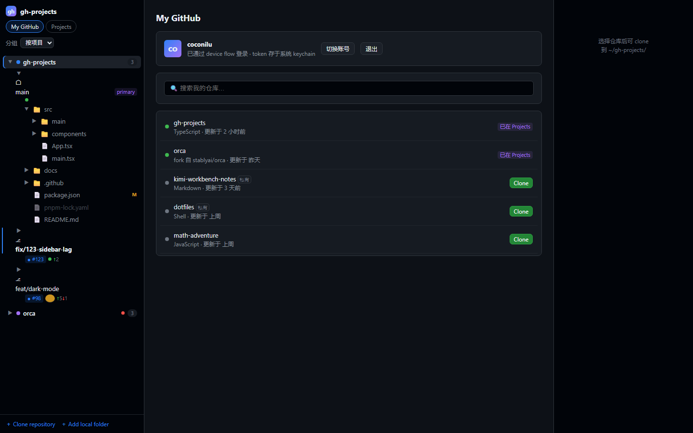
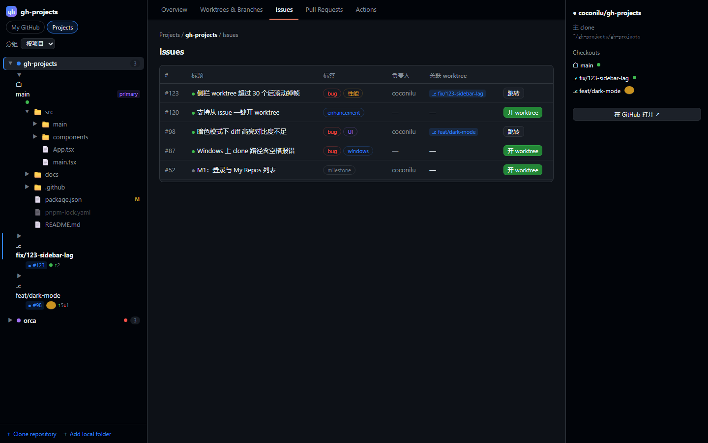
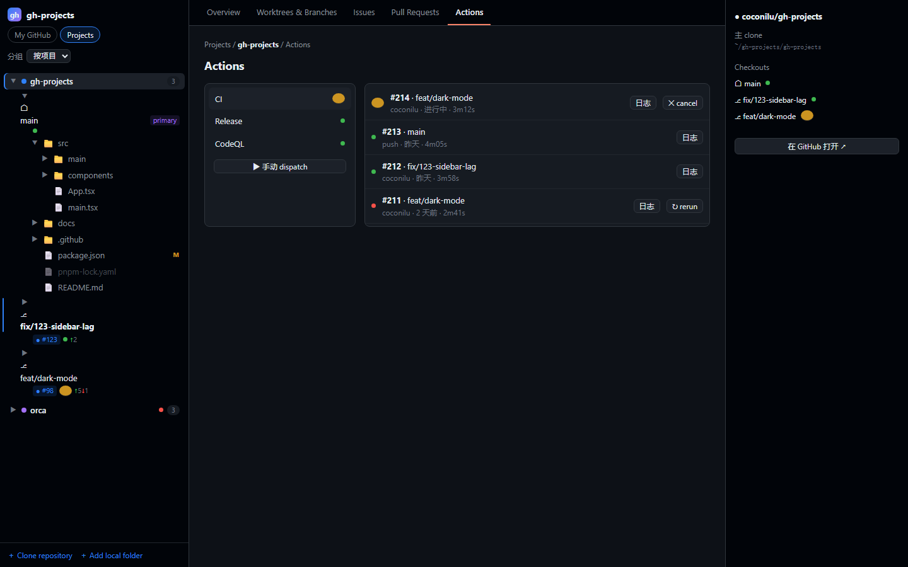

<p align="center">
	
</p>

<h1 align="center">GitGrove</h1>

<p align="center">
	以「项目 ↔ worktree ↔ issue/PR」关系为主轴的 GitHub 桌面客户端。<br/>
	A GitHub desktop client built around the project ↔ worktree ↔ issue/PR workflow.
</p>

<p align="center">
	<a href="https://github.com/coconilu/gitgrove/releases/latest"></a>
	<a href="https://github.com/coconilu/gitgrove/actions/workflows/ci.yml"></a>
	
	
</p>

---

GitHub Desktop 把 worktree 当配角、不管 Actions；Orca 的 worktree 最强但定位是 AI agent 编排器，「GitHub 账号 → 我的仓库 → clone → worktree → issue/PR → CI」这条链路在一个应用里闭环的，目前还没有人做。GitGrove 就是来做这件事的。



## 功能特性

- **My GitHub 面板** — 列出你的全部仓库（含私有），按最近活动排序，一键 clone 到约定目录并自动注册为项目
- **项目 ↔ checkout 两级侧栏** — 主 clone 与所有 worktree 平级展示，附 CI 状态点、关联 issue/PR 徽章、ahead/behind 计数
- **worktree 一等公民** — 新建/删除/锁定，在编辑器、终端、文件管理器中打开，删除走系统回收站
- **从 issue/PR 一键开 worktree** — 自动建分支并持久化关联；已有 worktree 时直接跳转，是最顺滑的一条链路
- **Issues / Pull Requests** — 表格视图（label、assignee、checks、review 状态）+ 详情，PR 可直接开 worktree 做本地 review
- **Actions 面板** — workflow 列表、run 历史、查看日志、手动 dispatch、rerun/cancel，不用开网页就能管 CI
- **右侧文件树 panel** — 懒加载目录树，git status 角标，单击预览（Markdown 渲染）、双击进编辑器
- **Open in Agent** — 一键把项目/worktree 在 Codex 或 Kimi Code 中打开（[细节与安全边界](docs/open-in-agents.md)）
- **自动更新** — 应用内检查并安装新版本，可在 About 面板查看当前版本

| My GitHub 与一键 clone | Issues 表格与「开 worktree」 | Actions 面板 |
| --- | --- | --- |
|  |  |  |

## 下载安装

从 [Releases](https://github.com/coconilu/gitgrove/releases/latest) 下载最新版本：

- **Windows**：NSIS 安装器（`.exe`）
- **macOS**：`.dmg` / `.app`

安装后通过 GitHub PAT 登录（需 `repo` + `workflow` scope）；如果本机 `gh` CLI 已登录，会自动复用其 token。token 只存系统 keychain，永不进入前端 JS 上下文。

## 技术栈

- **Tauri 2**（Rust 主进程）+ **React 19** + Tailwind 4 + zustand
- git 操作直接调用用户本机的 git 二进制；GitHub API 用 GraphQL 聚合列表 + REST 做 mutation
- 更多见 [架构文档](docs/architecture.md)

## 开发与构建

```powershell
pnpm -C app install
pnpm -C app tauri dev      # 开发模式（需要 Rust toolchain）
pnpm -C app tauri build    # 打包
```

完整的开发环境、测试与发布流程见 [开发指南](docs/development.md)。

## 文档

- [产品/技术方案](方案-GitHub项目管理应用.md) — 定位、竞品分析、完整需求
- [架构文档](docs/architecture.md) — 进程划分、数据模型、认证与安全
- [开发指南](docs/development.md) — 环境、命令、测试、CI/CD
- [在 Codex / Kimi Code 中打开](docs/open-in-agents.md) — Agent 集成与凭证边界
- [发布流程](.github/RELEASING.md) — 一键发版与自动更新

## 反馈

有建议或 bug 欢迎到 [Issues](https://github.com/coconilu/gitgrove/issues) 提出；推广与反馈汇总见置顶 issue。
